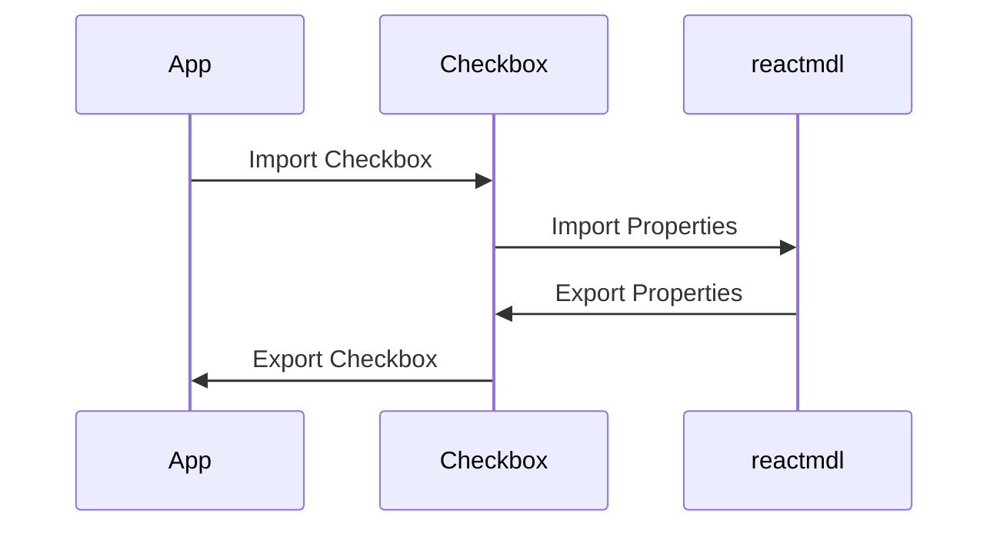
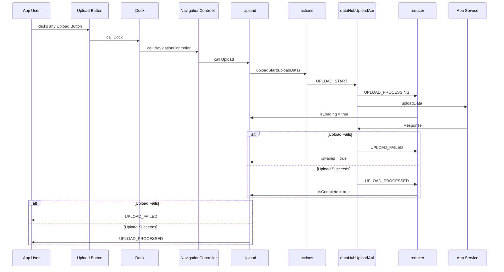

## Checkbox Sequence Diagram

```mermaid
sequenceDiagram
participant App
participant Checkbox
participant reactmdl
App ->> Checkbox: Import Checkbox
Checkbox ->> reactmdl : Import Properties
reactmdl ->> Checkbox : Export Properties
Checkbox ->> App : Export Checkbox
```

## Upload Sequence Diagram

```mermaid
sequenceDiagram
  participant App User
  participant Upload Button
  participant Dock
  participant NavigationController
  participant Upload
  participant actions
  participant dataHubUploadApi
  participant reducer
  participant App Service
    App User ->> Upload Button : clicks any Upload Button
    Upload Button ->> Dock : call Dock
    Dock ->> NavigationController : call NavigationController
    NavigationController ->> Upload : call Upload
    Upload ->> actions : uploadStart(uploadData)
    actions->> dataHubUploadApi : UPLOAD_START
    dataHubUploadApi ->> reducer : UPLOAD_PROCESSING
    dataHubUploadApi ->> App Service: uploadData
    reducer ->> Upload : isLoading = true
    App Service->> dataHubUploadApi: Response
    alt Upload Fails
      dataHubUploadApi->>reducer: UPLOAD_FAILED
      reducer->>Upload: isFailed = true
    else Upload Succeeds
      dataHubUploadApi->>reducer: UPLOAD_PROCESSED
      reducer->>Upload: isComplete = true
    end
    alt Upload Fails
     Upload ->> App User : UPLOAD_FAILED
    else Upload Succeeds
     Upload ->> App User : UPLOAD_PROCESSED
    end
```
